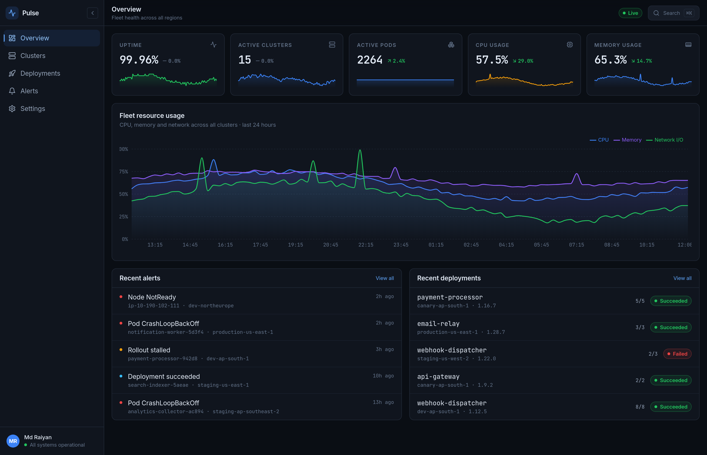
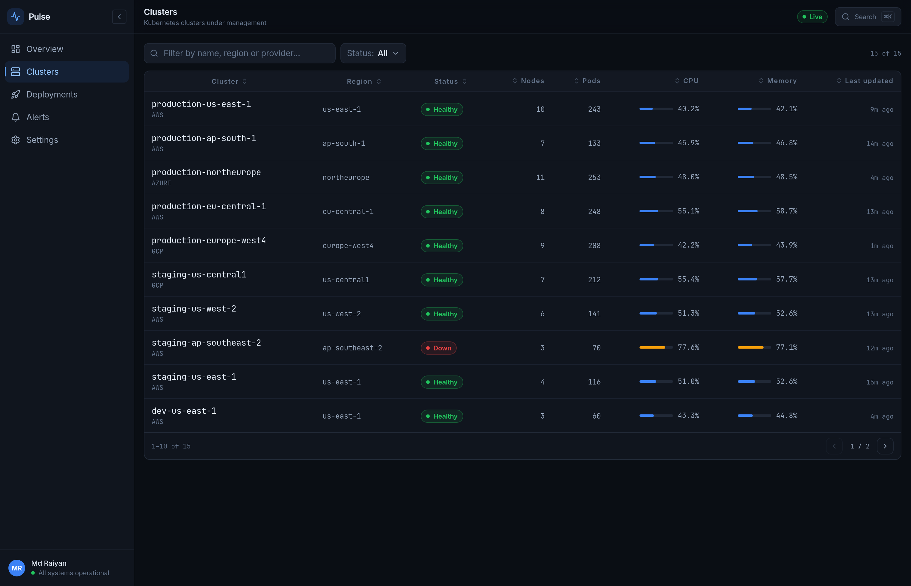
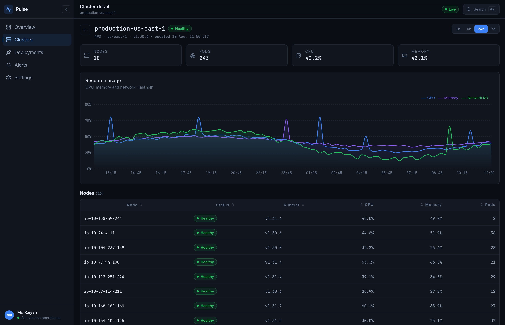
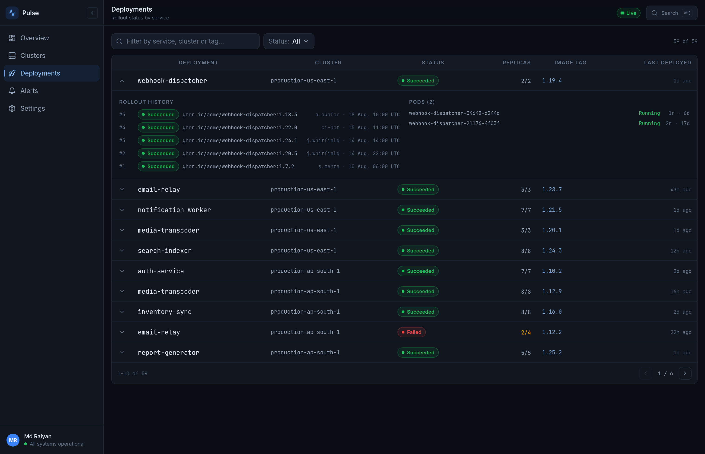
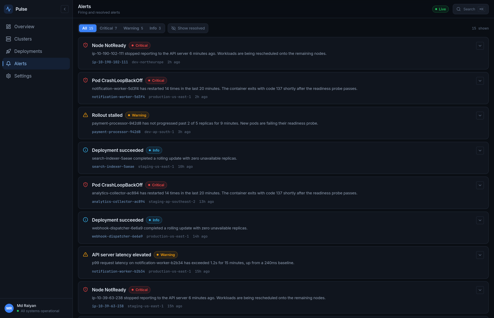
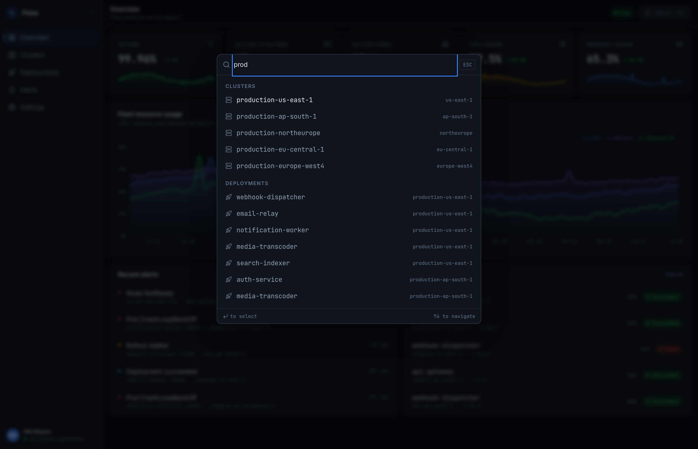
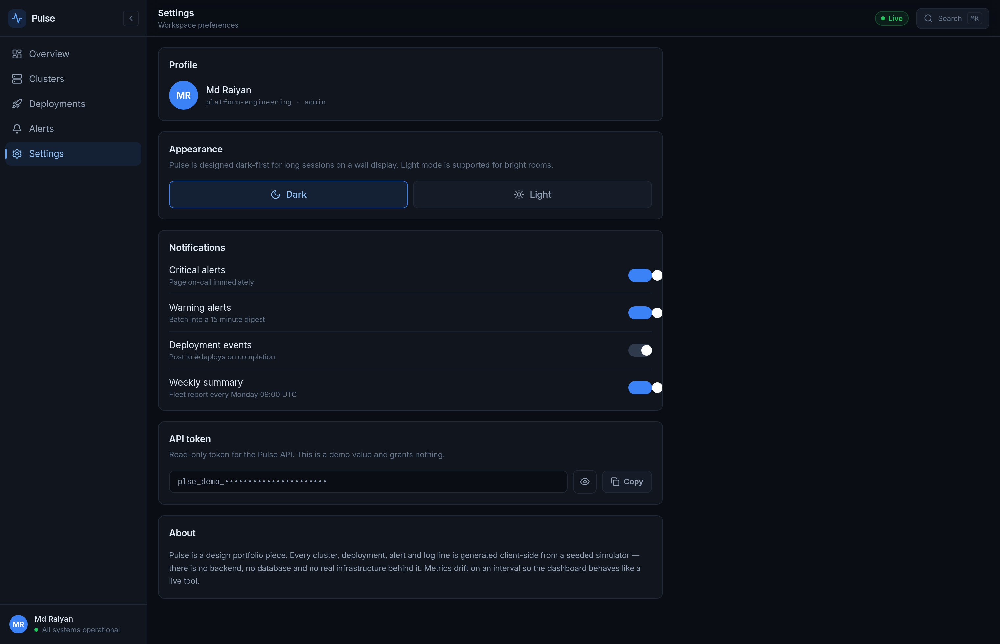

<div align="center">

# Pulse — Real-time infrastructure monitoring dashboard

A dense, dark-first monitoring UI for Kubernetes fleets: cluster health, rollouts, alerts and live log tails. Built as a design portfolio piece to demonstrate **data-heavy dashboard design** — the kind of tool an infrastructure engineer keeps open all day, not a marketing page.

[](https://nextjs.org)
[](https://www.typescriptlang.org)
[](https://tailwindcss.com)
[](https://recharts.org)
[](./LICENSE)

**[Live Demo](https://pulse-mdryaaan.vercel.app)**

</div>

<p align="center">
  
</p>

> [!NOTE]
> **Everything here is simulated.** There is no backend, no database and no real infrastructure. Clusters, nodes, deployments, alerts and log lines are generated client-side from a seeded simulator, and metrics drift on an interval so the dashboard behaves like a live tool.

---

## Screens

<table>
  <tr>
    <td width="50%"></td>
    <td width="50%"></td>
  </tr>
  <tr>
    <td align="center"><strong>Clusters</strong> — sortable, filterable, paginated</td>
    <td align="center"><strong>Cluster detail</strong> — charts, nodes, live logs</td>
  </tr>
  <tr>
    <td></td>
    <td></td>
  </tr>
  <tr>
    <td align="center"><strong>Deployments</strong> — inline rollout detail</td>
    <td align="center"><strong>Alerts</strong> — severity tabs, resolve toggle</td>
  </tr>
  <tr>
    <td></td>
    <td></td>
  </tr>
  <tr>
    <td align="center"><strong>Command palette</strong> — ⌘K from anywhere</td>
    <td align="center"><strong>Settings</strong> — theme, notifications, token</td>
  </tr>
</table>

---

## Features

- 📊 **Live-updating overview** — five stat cards with sparklines and trend deltas, drifting every few seconds with eased number transitions
- 📈 **Multi-series time-series charts** — CPU, memory and network zipped onto a shared time axis
- 🗂 **Real data tables** — sortable columns, search, status filters and pagination that resets correctly when the result set changes
- 🔍 **Command palette (⌘K / Ctrl+K)** — jump to any page, cluster or deployment by name
- 🖥 **Live log tail** — terminal-style panel streaming weighted log lines, with auto-follow that yields the moment you scroll up
- 🚨 **Alerts feed** — severity tabs, expandable detail, per-alert resolve toggle
- 🚀 **Deployment rollouts** — rows expand in place to show revision history and individual pod status
- ⏱ **Time range selector** — 1h / 6h / 24h / 7d, regenerating the series at the right resolution
- 🎨 **Dark-first design system** — one accent colour, semantic tokens, light mode as a first-class re-map
- 📱 **Responsive** — sidebar collapses to a drawer below `lg`, verified at 1440 / 900 / 520px
- ♿ **Keyboard accessible** — real radio groups, `aria-sort` on sortable headers, focus rings, `prefers-reduced-motion` respected
- 🧪 **Deterministic data** — seeded generators, so the server and the browser render byte-identical HTML

---

## Tech stack

| Layer           | Choice                                                  | Why                                                                      |
| --------------- | ------------------------------------------------------- | ------------------------------------------------------------------------ |
| Framework       | [Next.js 14](https://nextjs.org) (App Router)           | Static output; every page prerenders, including each cluster detail      |
| Language        | [TypeScript](https://www.typescriptlang.org) (`strict`) | The simulation and table generics are where mistakes hide                |
| Styling         | [Tailwind CSS](https://tailwindcss.com)                 | Semantic colour tokens in `tailwind.config.ts`, themed via CSS variables |
| Charts          | [Recharts](https://recharts.org)                        | Composable, and themeable straight from CSS variables                    |
| Animation       | [Framer Motion](https://www.framer.com/motion/)         | Eased metric transitions and page entrances                              |
| Command palette | [cmdk](https://cmdk.paco.me)                            | Accessible, unstyled, fuzzy-filtered                                     |
| Icons           | [lucide-react](https://lucide.dev)                      | Consistent stroke weight at small sizes                                  |

---

## Design notes

**Dark-first, not dark-mode-added.** The tokens are authored for a near-black ground (`#0a0e14`) and light mode re-maps the same semantic names. That ordering matters: a palette designed for white and then inverted produces muddy greys and glowing borders. Components read `bg-panel` / `text-fg` / `border-edge` and never branch on theme.

**Monospace for anything you compare.** Every number, identifier, timestamp and log line is JetBrains Mono with tabular figures; UI labels and navigation are Inter. Proportional digits shift width as values change, so a ticking metric jitters under the eye — tabular figures hold the layout still. Monospace also makes pod names and image tags scannable in a column, which is the whole job of an infrastructure table.

**One accent, three status colours, nothing else.** Blue (`#3b82f6`) marks interactive and selected state. Green, amber and red are reserved exclusively for health. A dashboard that colours things decoratively destroys its own alerting channel — if everything is colourful, red stops meaning anything.

**Density with hierarchy.** Rows are 40px, not 64px, because an operator wants twenty clusters on screen. Legibility comes from a strict type scale (11px labels, 13px body, mono for data) and generous _horizontal_ rhythm rather than vertical padding.

**The command palette is the real navigation.** Sidebars scale badly past a handful of routes; ⌘K scales to arbitrary resources. Pages, clusters and deployments are all searchable by name, so anything visible in the app is reachable by typing it.

**Motion confirms, it never performs.** Metrics ease to new values so a change is noticeable without a jump; charts do not replay their draw animation on every tick, which would be unreadable on a screen you leave open. Everything collapses under `prefers-reduced-motion`.

---

## How the simulation works

```
lib/simulate.ts    seeded PRNG (mulberry32), time-series generator, value drift
lib/mockData.ts    clusters, nodes, deployments, alerts, weighted log lines
hooks/             useLiveMetrics (interval drift), useSimulatedClock, useCommandPalette, useTheme
```

Three decisions worth calling out:

**Everything is seeded.** No `Math.random()` anywhere. Pulse is server-rendered, so unseeded randomness would produce different HTML on the server and the client and blow up on hydration. A fixed seed means both sides compute identical data; the "live" behaviour is layered on afterwards by intervals that only run in the browser.

**Series are layered, not noisy.** A metric line is a slow sinusoidal duty cycle (the working day), plus a mean-reverting random walk (drift), plus per-sample jitter, plus rare decaying spikes. Pure noise reads as static; a smooth curve reads as fake.

**Health is a quota, not a coin flip.** Cluster status is assigned from a fixed mix (~7% down, ~20% degraded) weighted by environment, rather than rolled per cluster. Independent rolls are right in expectation but not for any given seed — the first version produced a fleet where all fifteen clusters were healthy, which makes the status column, the colour coding and the status filter all look broken. Node statuses are then derived from the cluster's, so a degraded cluster actually contains a degraded node.

---

## Local development

**Requirements:** Node.js 18.17+ (20+ recommended).

```bash
git clone https://github.com/mdryaaan/pulse.git
cd pulse

npm install
npm run dev        # http://localhost:3000
```

| Command             | What it does                         |
| ------------------- | ------------------------------------ |
| `npm run dev`       | Dev server with hot reload           |
| `npm run build`     | Production build                     |
| `npm run start`     | Serve the production build           |
| `npm run lint`      | ESLint                               |
| `npm run typecheck` | `tsc --noEmit`                       |
| `npm run format`    | Prettier with Tailwind class sorting |

---

## Deployment

Deployed on Vercel — push to `main` auto-deploys, and every pull request gets a preview URL. Import the repo at [vercel.com/new](https://vercel.com/new); Next.js is detected automatically and there is nothing to configure — no environment variables, no database, no build flags.

Because the dataset is deterministic, every route prerenders to static HTML at build time, including each `/clusters/[id]` page.

---

## License

[MIT](./LICENSE) © 2026 Md Raiyan
